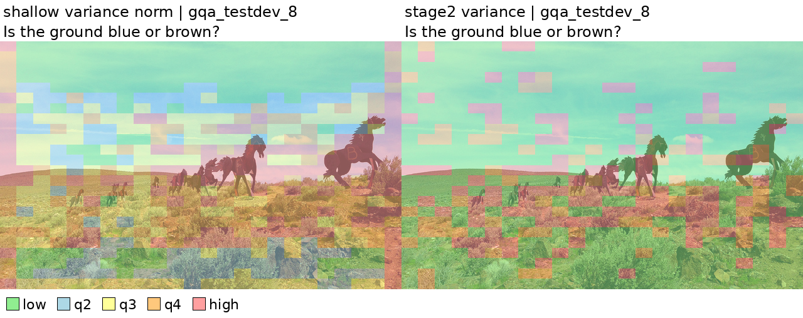
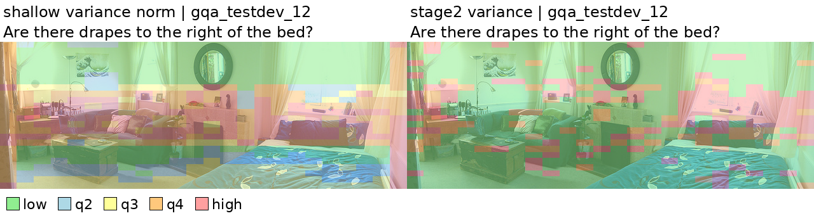
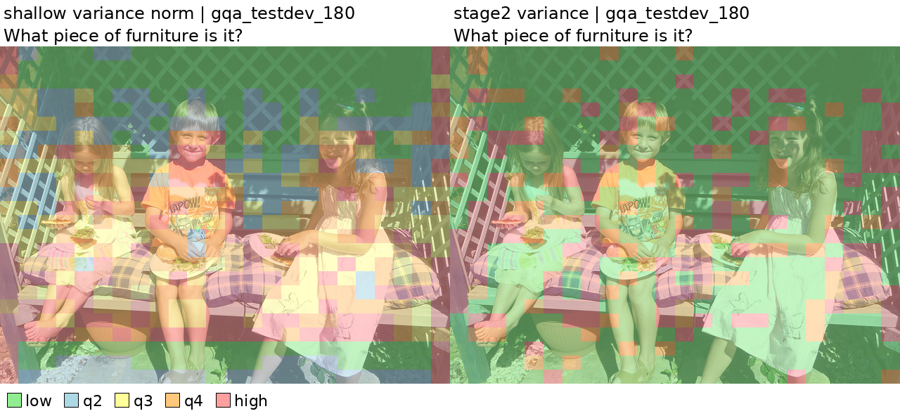
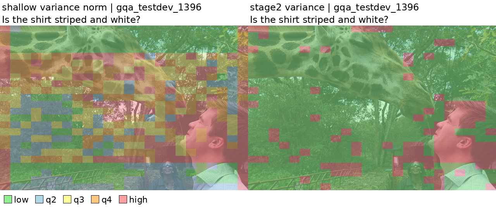
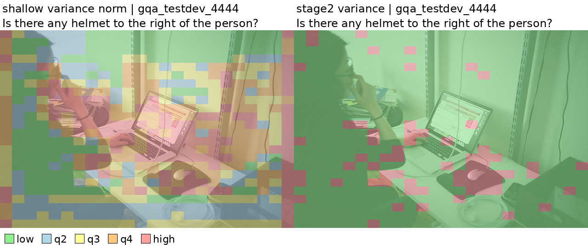

# Appendix_in_ICIP_2026
The additional figure and table interpretation based on the comments.
The three tables below are paired bootstrap statistic significance based on multiple tests using our model for different tasks (GQA, MME, AI2D, VizWiz_VQA). Values are reported as percentage point improvements for VQA tasks (GQA, AI2D, VizWiz-VQA), and raw score differences for MME. All comparisons are paired on the same test samples. 

**1. Keep Ratio = 0.1 (58 tokens)**
| Method                              | GQA                | MME         | AI2D                | VizWiz-VQA          |
| ----------------------------------- | ------------------ | ----------- | ------------------- | ------------------- |
| VScan + {u_i} in Both Stages        | +0.54 [0.09, 0.99] | +1 [0, 3]   | +0.62 [-0.36, 1.59] | +1.46 [0.65, 2.25]  |
| FastV + {u_i} in LLM Decoder        | +0.16 [0.00, 0.32] | +11 [3, 19] | +0.16 [0.03, 0.55]  | +0.05 [-0.25, 0.37] |
| VisionZip + {u_i} in Vision Encoder | +0.79 [0.29, 1.28] | -9 [-25, 5] | +0.13 [-0.67, 1.13] | +1.92 [1.07, 2.78]  |

**2. Keep Ratio = 0.2 (115 tokens)**
| Method                              | GQA                 | MME          | AI2D                | VizWiz-VQA           |
| ----------------------------------- | ------------------- | ------------ | ------------------- | -------------------- |
| VScan + {u_i} in Both Stages        | -0.02 [-0.41, 0.37] | +1 [-2, 4]   | +0.06 [-0.81, 0.91] | +0.74 [0.07, 1.44]   |
| FastV + {u_i} in LLM Decoder        | +0.05 [-0.07, 0.16] | +3 [-2, 8]   | +0.06 [-0.23, 0.32] | -0.32 [-0.53, -0.14] |
| VisionZip + {u_i} in Vision Encoder | +0.09 [-0.34, 0.52] | +13 [-7, 34] | -0.65 [-1.55, 0.29] | +1.41 [0.67, 2.18]   |

**3. Keep Ratio = 0.3 (173 tokens)**
| Method                              | GQA                 | MME           | AI2D                | VizWiz-VQA          |
| ----------------------------------- | ------------------- | ------------- | ------------------- | ------------------- |
| VScan + {u_i} in Both Stages        | +0.06 [-0.27, 0.40] | +10 [-6, 26]  | +0.06 [-0.68, 0.81] | +0.65 [0.05, 1.25]  |
| FastV + {u_i} in LLM Decoder        | +0.06 [-0.03, 0.14] | +1 [-4, 7]    | +0.16 [-0.13, 0.45] | +0.07 [-0.07, 0.21] |
| VisionZip + {u_i} in Vision Encoder | +0.02 [-0.36, 0.41] | -18 [-35, -1] | -0.16 [-1.04, 0.71] | +0.76 [0.07, 1.48]  |

The additional figures present the multi-head variances in our methods with more samples.

